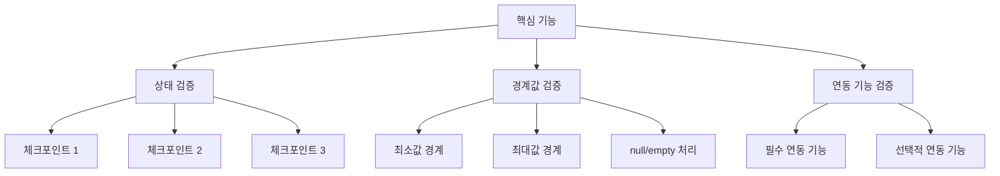

# 명령어: integration-test-helper

## 설명
AI 주도 코드 분석을 통해 pygame 기반 시각적 통합 테스트를 생성하는 명령어입니다. 사용자와의 협력적 검증을 통해 정확한 상태 검증과 최소 의존성을 보장하는 테스트 환경을 구축합니다.

## 사용법
```bash
/integration-test-helper <클래스명_또는_기능명>
```

## 실행 절차

### 1단계: 자동 코드 분석
```python
def analyze_target_feature(feature_name: str) -> dict:
    analysis = {
        "source_files": find_related_files(feature_name),
        "type_hints": extract_type_hints(),
        "boundary_conditions": identify_boundary_values(),
        "exception_handling": analyze_exception_patterns(),
        "business_logic": extract_business_rules(),
        "dependencies": map_component_dependencies()
    }
    return analysis
```

### 2단계: 사용자와 협력적 검증
- AI가 분석한 비즈니스 로직을 제시하고 사용자 확인
- 경계값과 예외처리 분석 결과를 사용자와 검토
- 3가지 테스트 방안을 제시하고 사용자와 논의
- 개발자 가정(precondition) 파악 및 문서화

### 3단계: 통합 테스트 생성
- 정확한 상태 검증을 우선으로 하는 단일 테스트 파일 생성
- 필요시 작업 계획 문서 먼저 생성 (docs/plan/{날짜}-{작업명}.md)

## AI 분석 시작 프로토콜

AI는 다음 순서로 분석을 진행하고 **각 단계마다 하나씩만 사용자에게 확인**합니다:

### 분석 1: 비즈니스 로직 파악
AI가 코드를 분석하여 비즈니스 로직을 파악한 후 사용자에게 확인을 요청합니다.

**분석 결과 제시 형태:**
```
📋 비즈니스 로직 분석 결과:
- 핵심 기능: [분석된 내용]
- 입력/출력: [분석된 내용]
- 상태 변화: [분석된 내용]
- 연관 컴포넌트: [분석된 내용]

이 분석이 정확한가요? 추가하거나 수정할 내용이 있나요?
```

### 분석 2: 경계값 및 예외처리 검토
타입 힌트와 코드 패턴을 분석하여 경계값과 예외처리를 파악합니다.

**분석 결과 제시 형태:**
```
🔍 경계값 및 예외처리 분석:
- 타입 힌트 기반 경계값: [분석된 내용]
- 발견된 예외처리: [분석된 내용]
- 개발자 가정으로 보이는 조건: [분석된 내용]
- 추가 검증이 필요한 경계값: [분석된 내용]

이 중에서 실제로 테스트해야 할 조건과 개발자 가정으로 남겨둬야 할 조건을 구분해주세요.
```

### 분석 3: 테스트 방안 제시
정확한 상태 검증과 최소 의존성을 기준으로 3가지 테스트 방안을 제시합니다.

**테스트 방안 제시 형태:**
```
🎯 테스트 방안 3가지 제시:

방안 1: [접근법명]
- 복잡성: ⭐⭐☆ (낮음/중간/높음)
- 핵심 기능 연관성: ⭐⭐⭐
- 테스트 독립성: ⭐⭐⭐
- 설명: [구체적인 방법]

방안 2: [접근법명]
- 복잡성: ⭐☆☆
- 핵심 기능 연관성: ⭐⭐☆
- 테스트 독립성: ⭐⭐⭐
- 설명: [구체적인 방법]

방안 3: [접근법명]
- 복잡성: ⭐⭐⭐
- 핵심 기능 연관성: ⭐⭐⭐
- 테스트 독립성: ⭐⭐☆
- 설명: [구체적인 방법]

어떤 방안을 선호하시나요? 또는 다른 접근법을 원하시나요?
```

### 분석 4: 최소 연동 기능 논의
핵심 기능과 함께 테스트할 최소한의 연동 기능을 제안합니다.

**연동 기능 제시 형태:**
```
🔗 최소 연동 기능 제안:
- 필수 연동: [반드시 함께 테스트해야 할 기능들]
- 선택적 연동: [추가하면 좋은 기능들]
- 제외 권장: [불필요한 복잡성을 추가하는 기능들]

이 구성이 적절한가요? 추가하거나 제외할 기능이 있나요?
```

## 통합 테스트 생성 템플릿

```python
# tests/total/test_visual_integration_{기능명}.py
"""
AI 분석 기반 {핵심_기능} 통합 테스트
분석된 비즈니스 로직: {AI가_분석한_비즈니스_로직}
검증 방안: {선택된_테스트_방안}
연동 기능: {최소_연동_기능들}

AI-NOTE : {날짜} 통합 테스트 생성
- 이유: {핵심_기능}의 정확한 상태 검증을 위한 시각적 통합 테스트
- 요구사항: 최소 의존성으로 정확한 상태 검증, pygame 기반 시각적 확인
- 검증 내용: {구체적인_검증_내용}
"""

import sys
import os
sys.path.insert(0, os.path.abspath(os.path.join(os.path.dirname(__file__), '../../..', 'src')))

import pygame
import pytest
from typing import Optional

# AI 분석으로 식별된 최소 필수 import
{AI가_분석한_필수_import들}

class TestVisual{기능명}Integration:
    """AI 분석 기반 {기능명} 통합 테스트"""

    def test_{기능명}_정확한_상태_검증_통합_시나리오(self) -> None:
        """1. {기능명} 정확한 상태 검증 통합 시나리오

        목적: AI 분석 기반 {핵심_기능}의 상태 검증
        테스트할 범위: {AI가_분석한_테스트_범위}
        커버하는 함수 및 데이터: {AI가_식별한_핵심_함수들}
        기대되는 안정성: {정확한_상태_검증_기준}
        개발자 가정 검증: {파악된_precondition들}
        """
        # Given - AI 분석 기반 최소 테스트 환경
        pygame.init()
        screen = pygame.display.set_mode((800, 600))
        pygame.display.set_caption("AI 분석: {기능명} 상태 검증")
        clock = pygame.time.Clock()

        # AI가 식별한 핵심 컴포넌트 초기화
        {AI가_분석한_컴포넌트_초기화}

        # AI가 파악한 precondition 설정
        {개발자_가정_기반_초기_설정}

        # When - 선택된 테스트 방안 실행
        test_duration = 5000  # 정확한 검증을 위한 충분한 시간
        start_time = pygame.time.get_ticks()

        # 상태 검증을 위한 체크포인트들
        verification_points = []

        running = True
        while running and (pygame.time.get_ticks() - start_time) < test_duration:
            current_time = pygame.time.get_ticks() - start_time

            # 이벤트 처리
            for event in pygame.event.get():
                if event.type == pygame.QUIT:
                    running = False

            # AI 분석 기반 핵심 로직 업데이트
            {선택된_테스트_방안_구현}

            # 정확한 상태 검증 체크포인트
            if current_time % 1000 == 0:  # 매 초마다 상태 검증
                state_snapshot = {
                    {AI가_식별한_중요_상태들}
                }
                verification_points.append((current_time, state_snapshot))

            # 시각적 렌더링
            screen.fill((0, 0, 0))

            # AI 분석 기반 핵심 요소 렌더링
            {최소_의존성_렌더링_구현}

            # 상태 정보 실시간 표시
            font = pygame.font.Font(None, 24)
            status_texts = [
                f"테스트 시간: {current_time//1000}s",
                f"검증 포인트: {len(verification_points)}개",
                {추가_상태_표시_정보}
            ]

            for i, text in enumerate(status_texts):
                rendered_text = font.render(text, True, (255, 255, 255))
                screen.blit(rendered_text, (10, 10 + i * 25))

            pygame.display.flip()
            clock.tick(60)

        # Then - 정확한 상태 검증
        pygame.quit()

        # AI 분석 기반 상태 검증
        assert len(verification_points) >= 3, "충분한 검증 포인트가 수집되어야 함"

        # 경계값 검증 (AI가 식별한 경계값들)
        {AI가_식별한_경계값_검증}

        # 예외처리 검증 (AI가 분석한 예외 상황들)
        {AI가_분석한_예외_상황_검증}

        # 비즈니스 로직 검증 (AI가 파악한 핵심 로직)
        {AI가_분석한_비즈니스_로직_검증}

    def test_{기능명}_경계값_및_예외처리_검증_시나리오(self) -> None:
        """2. {기능명} 경계값 및 예외처리 검증 시나리오"""
        # AI가 분석한 경계값들을 체계적으로 테스트
        {경계값_테스트_구현}

    def test_{기능명}_최소_연동_기능_검증_시나리오(self) -> None:
        """3. {기능명} 최소 연동 기능 검증 시나리오"""
        # AI가 제안한 최소 연동 기능들과의 상호작용 테스트
        {연동_기능_테스트_구현}

# 개발자 가정 문서화 (AI가 파악한 precondition들)
"""
# AI-DEV : 개발자 가정 및 precondition 문서화
# - 분석된 가정들: {파악된_개발자_가정들}
# - 추가된 assert들: {새로_추가된_assert들}
# - 문서화된 precondition들: {문서화된_전제조건들}

{AI가_파악한_개발자_가정_문서화}
"""

# 실행 가능한 독립 스크립트
if __name__ == "__main__":
    test = TestVisual{기능명}Integration()
    print("AI 분석 기반 통합 테스트 실행 중...")
    test.test_{기능명}_정확한_상태_검증_통합_시나리오()
    test.test_{기능명}_경계값_및_예외처리_검증_시나리오()
    test.test_{기능명}_최소_연동_기능_검증_시나리오()
    print("모든 테스트 완료")
```

### 작업 계획 문서 템플릿 (대규모 테스트용)

테스트가 복잡해질 경우 먼저 생성되는 계획 문서:

```markdown
# {기능명} 통합 테스트 작업 계획

**날짜**: {생성날짜}
**대상**: {테스트할_기능명}
**복잡도**: 높음 (계획 문서 필요)

## AI 분석 요약

### 비즈니스 로직 분석
{AI가_분석한_비즈니스_로직_요약}

### 기술적 복잡성 분석
- 연관 컴포넌트 수: {개수}
- 의존성 깊이: {깊이}
- 테스트 시나리오 수: {개수}

## 테스트 아키텍처



## 작업 단계

### 1단계: 핵심 상태 검증 테스트
- [ ] 기본 상태 변화 검증
- [ ] 체크포인트 기반 상태 추적
- [ ] 시각적 확인 요소 구현

### 2단계: 경계값 및 예외처리 테스트
- [ ] AI 분석 경계값 검증
- [ ] 예외 상황 처리 확인
- [ ] Assert 문 추가

### 3단계: 연동 기능 테스트
- [ ] 최소 연동 기능 구현
- [ ] 상호작용 검증
- [ ] 독립성 보장

### 4단계: 문서화 및 정리
- [ ] 개발자 가정 문서화
- [ ] Precondition 명시
- [ ] 테스트 실행 가이드 작성
```

## 핵심 개선사항 요약

### 🔧 주요 변경점
1. **AI 주도 분석**: 사용자 질문 전에 코드 분석 우선
2. **단일 질문 원칙**: 각 단계별로 하나씩만 확인
3. **협력적 검증**: AI 분석 결과를 사용자와 함께 검토
4. **정확한 상태 검증**: 체크포인트 기반 상태 추적
5. **개발자 가정 파악**: precondition 자동 식별 및 문서화

### 🎯 워크플로우 개선
- **기존**: 사용자에게 질문 → 답변 대기 → 테스트 생성
- **개선**: AI 분석 → 결과 제시 → 사용자 검증 → 개선된 테스트 생성

### 📋 출력 품질 향상
- **정확한 상태 검증**: 매초 체크포인트로 상태 추적
- **최소 의존성**: AI가 필수 import만 식별하여 포함
- **개발자 가정 보존**: precondition을 테스트에서 제외하고 문서화
- **통합 테스트**: 3개 시나리오를 하나의 파일에 통합

## 사용자 편집 가이드

이 개선된 명령어는 다음과 같이 동작합니다:

### 사용 예시
```bash
/integration-test-helper PlayerMovementSystem
```

### 실행 과정
1. **AI 자동 분석** (사용자 대기 불필요)
2. **비즈니스 로직 확인** (1개 질문)
3. **경계값/예외처리 확인** (1개 질문)
4. **테스트 방안 선택** (1개 질문)
5. **연동 기능 확인** (1개 질문)
6. **테스트 생성** 또는 **계획 문서 생성**

### 생성 결과
- **단순한 경우**: 완성된 통합 테스트 파일
- **복잡한 경우**: 계획 문서 + 단계별 구현 가이드